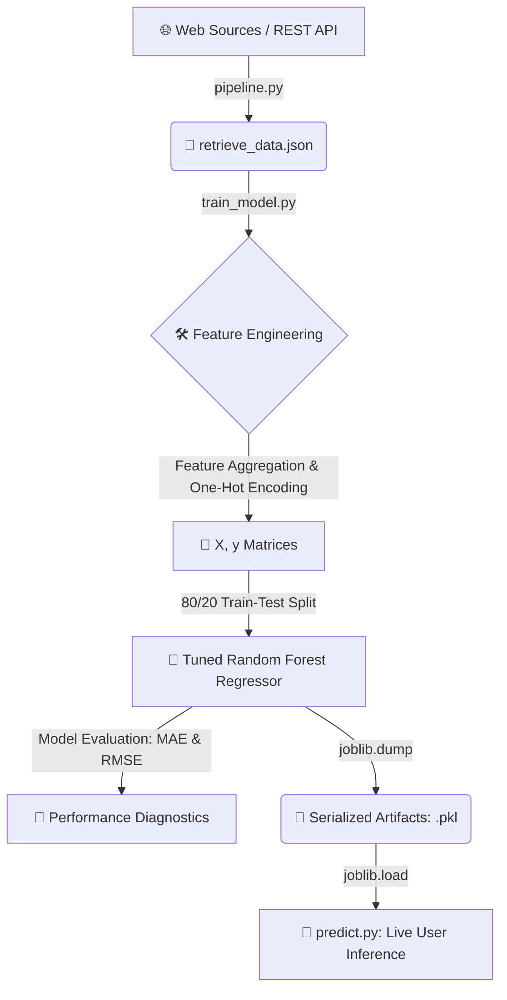

```mermaid
graph TD
    A[🌐 Web Sources / REST API] -->|pipeline.py| B(📄 retrieve_data.json)
    B -->|train_model.py| C{🛠️ Feature Engineering}
    C -->|Feature Aggregation & One-Hot Encoding| D[📐 X, y Matrices]
    D -->|80/20 Train-Test Split| E[🧠 Tuned Random Forest Regressor]
    E -->|Model Evaluation: MAE & RMSE| F[🏁 Performance Diagnostics]
    E -->|joblib.dump| G(💾 Serialized Artifacts: .pkl)
    G -->|joblib.load| H[🔮 predict.py: Live User Inference]
```
